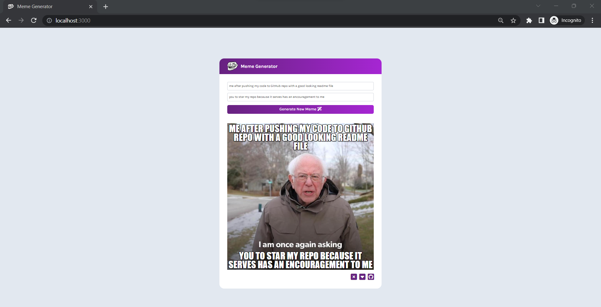

<h2 align="center">
  Meme Generator
</h2>

<p align="center">

  <a href="#">
    
  </a>
  
  <hr />
  
  <a href="#">
    
  </a>
  
</p>

## Getting Started with Create React App

This project was bootstrapped with [Create React App](https://github.com/facebook/create-react-app).
In the project directory, you can run:

```bash
npm start
```

Runs the app in the development mode.\
Open [http://localhost:3000](http://localhost:3000) to view it in your browser.
